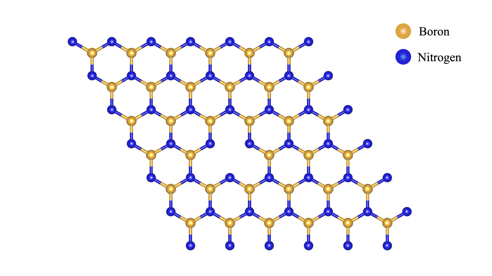
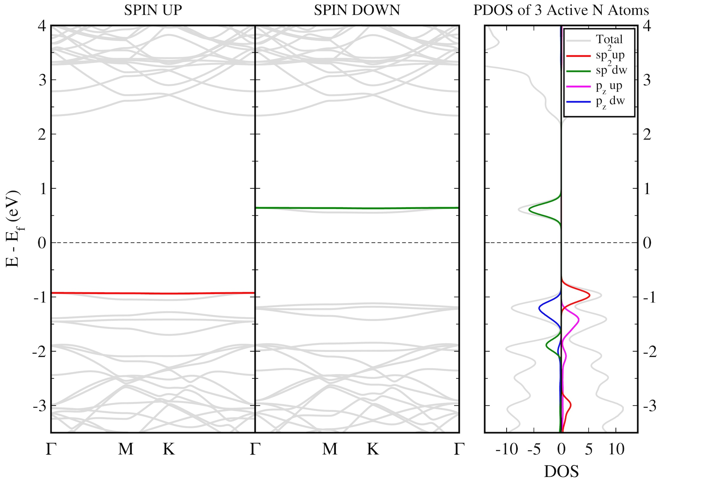
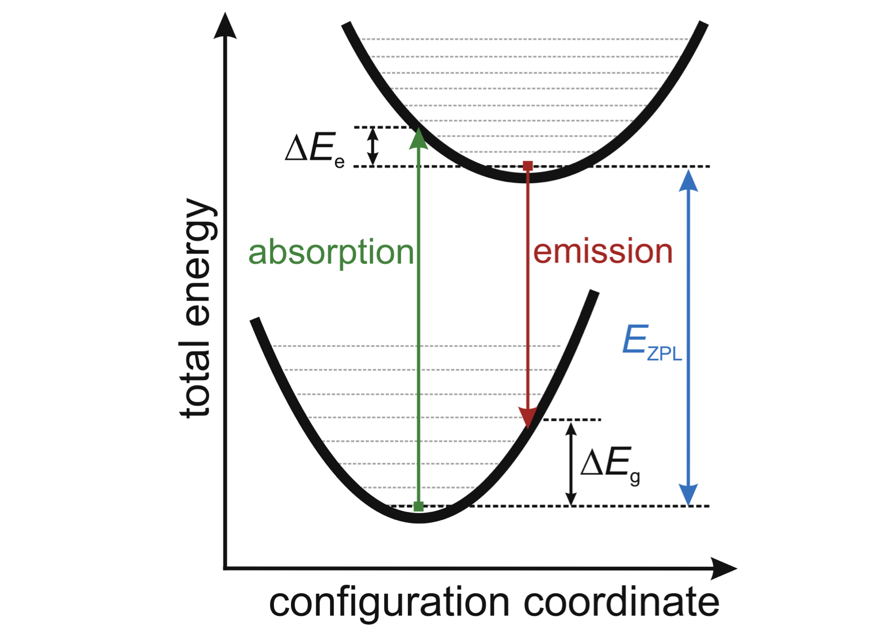
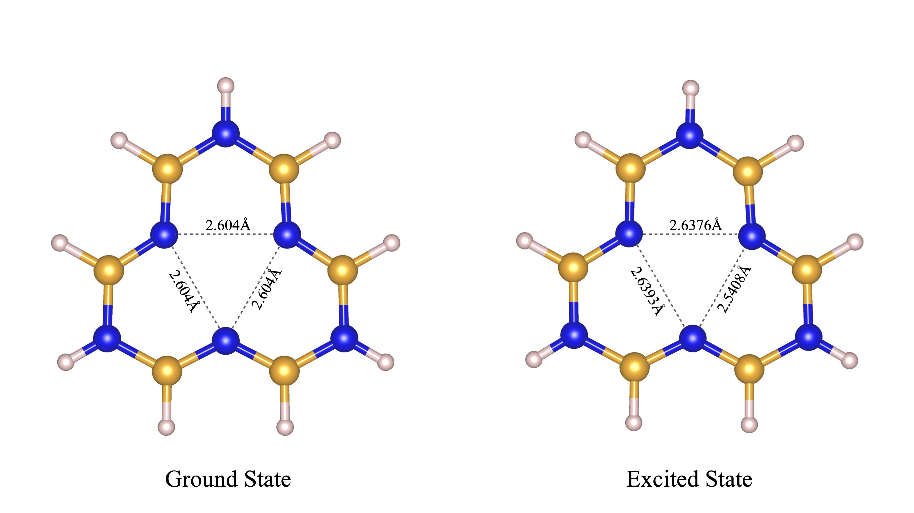
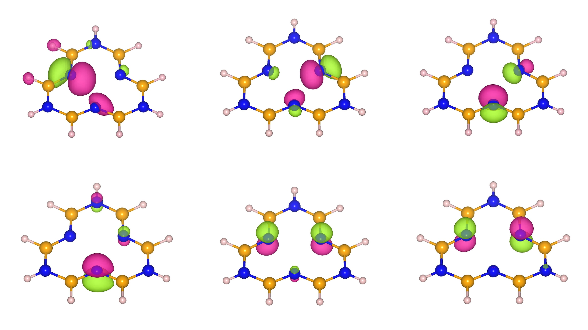
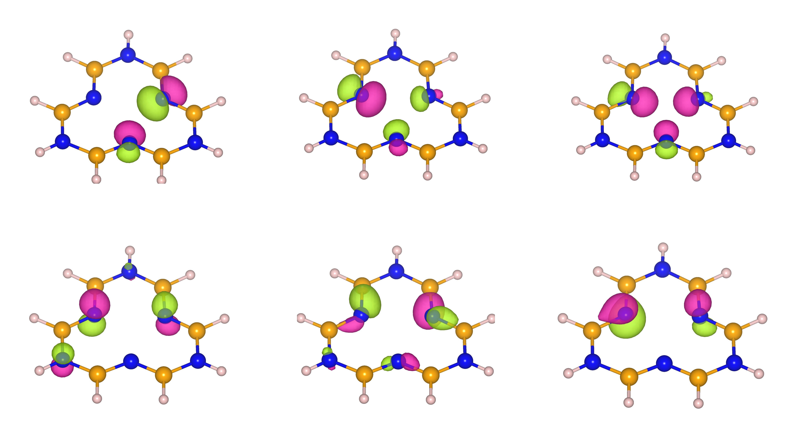

<div align="center">

# Hybrid Classical-Quantum Embedding Approach for <i>V</i><sub>B</sub><sup>&minus;</sup> Defect in Hexagonal Boron Nitride(hBN)

</div>

## Introduction

Exact classical simulation of the electronic structure of strongly coorelated systems using single-reference methods like Density Functional Theory(DFT) or Hartree Fock(HF) is often unfeasible or inaccuratre. To successfully capture the effects of strong correlation in a system, multi-reference methods like Full Configuration Interaction(FCI) is required. However, these methods scales factorially with respect to the size of the system under consideration, making them computationally intractable for larger molecular systems.

Embedding methods address this bottleneck by first partitioning a system and then applying different levels of theory to each region. A highly accurate but computationally expensive method is applied to a small active region, while the surrounding environment is handled with a more efficient but approximate method. This allows the most physically relevant details to be captured while avoiding the computational cost of accurately simulating the entire system.

In this project, we apply a hybrid classical-quantum embedding approach to study the negatively charged boron vacancy ($V_B^-$) in hexagonal boron nitride(hBN). By treating the bulk crystal environment classically and mapping the highly correlated active space to a quantum computational pipeline<a href="#ref8">[8]</a>, we efficiently simulate the electronic ground and excited states of the defect to compute its Zero-Phonon Line(ZPL). We then compare the results against exact classical approaches and experimental benchmarks.

### The Negatively Charged Boron Vacancy in hBN

The $V_B^-$ defect in hexagonal boron nitride has emerged as a higly promising solid-state color center for application in quantum sensing and quantum information processing<a href="#ref4">[4]</a>. To model this localized defect and ensure our electronic structure calculations are grounded in physically accurate geometries, the inital structural optimization was performed using periodic Density Functional Theory(DFT). Specifically, we utilized Quantum Espresso<a href="#ref14">[14]</a> with the PBE exchange-coorelation functional to relax a 49-atom hBN supercell. This periodic relaxation effectively captures the bulk dynamics, providing the optimized, atomic coordinates for both the highly symmetric ground state and the Jahn-Teller distorted excited state.

<p align="center">
  
</p>

While periodic DFT is ideal for structural relaxation, executing highly correlated, multi-reference wavefunction calculations on a full 49-atom supercell is computationally intractable. To facilitate the subsequent Restricted Open-Shell Hartree-Fock (ROHF) and Complete Active Space (CAS) calculations in PySCF<a href="#ref15">[15]</a>, we constructed a comparatively smaller finite molecular cluster, balancing computational feasibility at the cost of some long-range accuracy. We extracted a 21-atom core from the optimized supercell, capturing the central missing boron atom (the vacancy) alongside the immediate surrounding shells of active nitrogen and boron atoms. To effectively truncate the boundaries of the 2D crystal and prevent artificial edge effects, this finite system was passivated with 18 capping hydrogen atoms positioned according to the local bonding geometry.

### Electronic Structure

The $V_B^-$ defect in hBN exhibits $D_{3h}$ point-group symmetry in its idealized, unrelaxed lattice configuration. The removal of a single boron atom leaves behind unpassivated "dangling bonds" on the three immediately adjacent nitrogen atoms, which primarily dictate the defect's localized electronic properties. These atomic orbitals consist of three in-plane $sp^2$($\sigma$) hybridized orbitals and three out-of-plane 2$p_z$ ($\pi$) orbitals. Following the symmetry rules of the $D_{3h}$ group, these six atomic orbitals hybridize to form six symmetry-adapted defect molecular orbitals (MOs)<a href="#ref2">[2]</a>. Specifically, the in-plane $sp^2$ bonds combine to produce one non-degenerate $a_1$' state and two degenerate $e$' states, while the out-of-plane $p_z$ orbitals combine into one non-degenerate $a_2$'' state and two degenerate $e$'' states.

<div align="center">

| Defect State | Orbital Origin | Degeneracy | 
|:---:|:---:|:---:|
| <i>a</i><sub>1</sub>'' | in-plane <i>sp</i><sup>2</sup> (&sigma;) | 1 |
| <i>e</i>' | in-plane <i>sp</i><sup>2</sup> (&sigma;) | 2 |
| <i>a</i><sub>2</sub>'' | out-of-plane 2<i>p<sub>z</sub></i> (&pi;) | 1 |
| <i>e</i>'' | out-of-plane 2<i>p<sub>z</sub></i> (&pi;) | 2 |

</div>

To form the fully characterized $V_B^-$ defect, these six isolated molecular orbitals must accommodate a total of 10 active electrons: nine contributed natively by the surrounding nitrogen atoms, plus one extra electron captured from the lattice environment. The majority of these highly localized states reside deep within the wide fundamental bandgap of the hBN host, largely isolating them from the bulk valence and conduction bands. In the ground-state electronic configuration, the lowest-energy defect orbitals are completely filled, leaving the doubly degenerate $e$′ orbital exactly half-occupied by two electrons. Dictated by Hund’s rules, these two electrons align with parallel spins to minimize Coulombic repulsion, yielding a highly correlated, spin-triplet (S=1) ground state formally designated as $^3A'_2$<a href="#ref1">[1]</a>.

### Band Dispersion and Projected DOS

Our classical mean-field initialization employs Density Functional Theory (DFT) using PBE functional. While PBE accurately captures the qualitative orbital ordering and localization, it is documented that standard semi-local functionals systematically underestimate the fundamental bandgap of systems like hBN. Consequently, PBE also underestimates the optical transition energies and the Zero-Phonon Line (ZPL). For highly accurate quantitative bandgaps and excitation energies, one can employ hybrid functionals such as HSE06, which correct this underestimation by incorporating a fraction of exact Hartree-Fock exchange.

<p align="center">
  
</p>

Despite the bandgap underestimation, our PBE-calculated spin-polarized band structure and Projected Density of States (PDOS) perfectly capture the essential defect physics and it is in agreement with the reported data<a href="#ref3">[3]</a>. The defect states appear as flat dispersionless bands completely isolated from the bulk continuum. The left and middle panels display the energy dispersion along high-symmetry k-points ($\Gamma - M - K - \Gamma$) for the majority (Spin Up) and minority (Spin Down) spin channels, respectively. Within the bandgap of the host hBN lattice, the defect introduces isolated, deep-level electronic states.

The right panel isolates the density of states originating strictly from the three nearest-neighbor "active" Nitrogen atoms surrounding the vacancy. The sharp PDOS peaks align perfectly with the flat bands in the dispersion plot, revealing the exact atomic character of these localized states. The dominant contributions to the flat defect band inside the deep band gap arise from the strongly interacting in-plane $sp^2$ dangling bonds<a href="#ref3">[3]</a>. When the central Boron atom is removed, the broken bonds on the adjacent Nitrogens point directly into the vacancy, completely dominating the electronic signature of the defect. The out-of-plane $p_z$ orbital contribute to the defect state which sits right above the valance band. It is reported that other defect states may sits deeper inside the bulk continuum and not be visible at the gap.

### The Zero Phonon Line (ZPL)

Following the Franck-Condon principle, optical absorption occurs as a vertical transition, because the absorption of a photon is virtually instantaneous compared to the sluggish movement of the heavy hBN nuclei. Immediately following this vertical excitation, the defect is left in a highly excited vibrational state of the upper electronic manifold. To minimize its energy, the surrounding hBN lattice undergoes a rapid structural reorganization to a new equilibrium geometry, dissipating the excess energy ($\Delta E_e$) via the emission of phonons into the bulk lattice. Following the photon emission, a similar structural relaxation occurs in the ground state, dissipating the energy $\Delta E_g$ as the lattice returns to its original configuration.

<p align="center">
  
</p>

The Zero-Phonon Line (ZPL), denoted as $E_{ZPL}$ in the diagram<a href="#ref9">[9]</a>, is defined as the energy difference between the absolute lowest vibrational levels (the zero-point energies) of the excited and ground electronic states. It represents the purely electronic, elastic transition where absolutely no phonons are created or annihilated in the host lattice. Because ZPL photons are decoupled from the thermal vibrations of the host material, they are highly coherent and indistinguishable, which can be helpful for utilizing the defect as a high-fidelity spin-photon interface.

### Objective and Workflow

The primary objective of this study is to demonstrate a proof-of-concept framework for simulating the $V_B^-$ defect in hBN by integrating classical ab-initio methods with near-term quantum algorithms to compute the Zero-Phonon Line(ZPL). By isolating the strongly correlated electrons into a defined active space, we can offload the most computationally demanding part of the simulation onto a quantum coprocessor.

To achieve this, we used a modular, four-step pipeline combining PySCF for the classical environment and Qiskit for the quantum simulation:
* **Classical Pre-processing**: PySCF<a href="#ref15">[15]</a> executes ROHF and State-Averaged CASSCF(10,6) calculations to isolate the active space and extract the essential interaction integrals($h_1$, $h_2$) and core energy shifts($E_{core}$) for both ground and excited state geometries.
- **Hamiltonian Mapping**: Qiskit<a href="#ref16">[16]</a> transforms the classical integrals into fermionic operators, applying a Parity Mapper with 2-qubit reduction to yield an efficient, compressed 10-qubit Hamiltonian.
+ **Variational Quantum Optimization**: A Variational Quantum Eigensolver(VQE) pipline(UCCSD ansatz, L-BFGS-G Optimizer) minimizes the ground state, while a Variational Quantum Deflation(VQD) approach resloves the excited state.
* **ZPL Evaluation and Benchmarking**: The quantum eigenvalues and classical core shifts are recombined to compute the final ZPL. This quantum derived result is explicitly validated against exact classical Full Configuration Interaction(FCI) calcualtions and further benchmarked against a classical reference ZPL obtained via constrained occupation($\Delta$SCF) methods.

## Classical Pre-processing

Before building the molecular cluster and defining our active space, we first initialize our computational environment. This workflow relies heavily on **PySCF**<a href="#ref15">[15]</a> for the classical mean-field calculations, and **Qiskit** for the quantum embedding and variational algorithms.


```python
import numpy as np
import time
import warnings
from scipy.optimize import minimize
#PySCF Libraries
from pyscf import gto, scf, mcscf, ao2mo, mrpt
from pyscf.tools import cubegen
#Qiskit Libraries
from qiskit.primitives import StatevectorEstimator
from qiskit.quantum_info import Statevector
from qiskit_algorithms.optimizers import L_BFGS_B
from qiskit_algorithms import VQE, NumPyEigensolver
from qiskit_nature.second_q.mappers import ParityMapper
from qiskit_nature.second_q.circuit.library import HartreeFock, UCCSD
from qiskit_nature.second_q.hamiltonians import ElectronicEnergy
```

To model the defect environment, we extract a finite 21-atom core from the optimized supercell by converting fractional lattice vectors into Cartesian coordinates. We then passivate the boundaries of this finite cluster with 18 capping hydrogen atoms based on the local bonding geometry to prevent artificial edge effects.


```python
#Lattice vectors of the system.
a1 = np.array([12.5000000000,       0.0000000000,       0.0000000000])
a2 = np.array([-6.2500000000,      10.8253175473,       0.0000000000])
a3 = np.array([ 0.0000000000,       0.0000000000,      15.0000000000])

#Converting fractional coordinates to Cartesian.
def cartesian(f1, f2, f3):
    return f1*a1 + f2*a2 + f3*a3
```


```python
#Extracting the relaxed atomic positions for the GROUND STATE from Quantum Espresso to build the molecular cluster.

#Shell 1: The 3 neighbouring active Nitrogen atoms around the defect.
N14_gd = cartesian(0.3305536372,        0.2611072728,        0.4999999978)
N16_gd = cartesian(0.3305536354,        0.4694463646,        0.4999999997)
N25_gd = cartesian(0.5388927241,        0.4694463621,        0.5000000028)

#Shell 2: The 6 Boron atoms bonded to the active Nitrogen atoms
B13_gd = cartesian(0.2016924176,        0.2021843359,        0.4999999990)
B15_gd = cartesian(0.2016924232,        0.3995080813,        0.5000000003)
B23_gd = cartesian(0.4004919181,        0.2021843358,        0.4999999997)
B26_gd = cartesian(0.4004919196,        0.5983075798,        0.5000000006)
B34_gd = cartesian(0.5978156586,        0.3995080814,        0.5000000007)
B36_gd = cartesian(0.5978156601,        0.5983075822,        0.5000000007)

#Shell 3: The 3 shared Nitrogen atoms bonded to the Boron atoms
N4_gd  = cartesian(0.1320759189,        0.2660379573,        0.5000000006)
N24_gd = cartesian(0.5339620385,        0.2660379564,        0.5000000002)
N27_gd = cartesian(0.5339620426,        0.6679240854,        0.4999999998)

#Extracting the relaxed atomic positions for the EXCITED STATE from Quantum Espresso to build the molecular cluster.

#Shell 1: The 3 neighbouring active Nitrogen atoms around the defect.
N14_ex = cartesian(0.3348277171,        0.2618817634,        0.5000000040)
N16_ex = cartesian(0.3297078993,        0.4704152601,        0.5000000068)
N25_ex = cartesian(0.5380514236,        0.4651823991,        0.5000000049)

#Shell 2: The 6 Boron atoms bonded to the active Nitrogen atoms
B13_ex = cartesian(0.2062753433,        0.2047238951,        0.5000000015)
B15_ex = cartesian(0.2000874808,        0.4029447437,        0.5000000036)
B23_ex = cartesian(0.4013630661,        0.2007451131,        0.5000000010)
B26_ex = cartesian(0.3971106152,        0.6000401304,        0.5000000052)
B34_ex = cartesian(0.5991202767,        0.3985777897,        0.5000000029)
B36_ex = cartesian(0.5952071597,        0.5937641140,        0.5000000034)

#Shell 3: The 3 shared Nitrogen atoms bonded to the Boron atoms
N4_ex  = cartesian(0.1344105047,        0.2686500409,        0.5000000019)
N24_ex = cartesian(0.5353113819,        0.2646365508,        0.4999999999)
N27_ex = cartesian(0.5313935818,        0.6657227884,        0.5000000036)
```

Before proceeding with the electronic structure calculations, we must verify the structural integrity of our defined clusters. The code below calculates the distances between the central boron vacancy and its three nearest-neighbor nitrogen atoms (Shell 1) for both the ground and excited states to confirm their point-group symmetries.


```python
#Geometry and Symmetry verification.

# The vacancy site (Missing Boron atom).
vacancy = cartesian(0.4, 0.4, 0.5)

def dist(atom1, atom2):
    return np.linalg.norm(atom1 - atom2)

print("GROUND STATE: Shell 1 Symmetry")
print('-'*30)
print(f"Vacancy to N14_gd: {dist(vacancy, N14_gd):.5f} Å")
print(f"Vacancy to N16_gd: {dist(vacancy, N16_gd):.5f} Å")
print(f"Vacancy to N25_gd: {dist(vacancy, N25_gd):.5f} Å")
print("Perfect C3v Symmetry.")

print("\nEXCITED STATE: Shell 1 Symmetry")
print('-'*30)
print(f"Vacancy to N14_ex: {dist(vacancy, N14_ex):.5f} Å")
print(f"Vacancy to N16_ex: {dist(vacancy, N16_ex):.5f} Å")
print(f"Vacancy to N25_ex: {dist(vacancy, N25_ex):.5f} Å")
```

    GROUND STATE: Shell 1 Symmetry
    ------------------------------
    Vacancy to N14_gd: 1.50356 Å
    Vacancy to N16_gd: 1.50356 Å
    Vacancy to N25_gd: 1.50356 Å
    Perfect C3v Symmetry.
    
    EXCITED STATE: Shell 1 Symmetry
    ------------------------------
    Vacancy to N14_ex: 1.49596 Å
    Vacancy to N16_ex: 1.52320 Å
    Vacancy to N25_ex: 1.49522 Å


\
As confirmed by the output, the ground state maintains a perfect $C_{3v}$ symmetry, with all three nearest-neighbor nitrogen bonds being identical at 1.50356 Å. 

However, the excited state undergoes a spontaneous structural relaxation known as the **Jahn-Teller distortion**. Because the excited electronic state is orbitally degenerate, the system lowers its overall energy by breaking its highly symmetric geometry. This symmetry breaking is clearly evident in the unequal bond lengths of the excited cluster, which lifts the electronic degeneracy and physically drives the defect into a new, stable configuration.

### Boundary Passivation using Hydrogen atoms

To prevent unphysical "dangling bonds" at the boundaries of our finite cluster from artificially skewing the electronic structure, we must passivate the edge atoms with Hydrogen caps. 

To place these caps physically, we use the local geometry of the cluster. For each boundary atom, we:
1. Identify its two nearest neighbors within the cluster.
2. Calculate the unit vectors pointing from the boundary atom to these neighbors.
3. Determine the direction exactly opposite to the vector sum of these bonds, simulating the trajectory of the missing lattice connection.
4. Place a Hydrogen atom along this trajectory using standard equilibrium bond lengths ($B-H = 1.19$ Å, $N-H = 1.01$ Å).


```python
#Group all atoms into dictionaries for easy distance checking.
atoms_gd = {
    'N14_gd': N14_gd, 'N16_gd': N16_gd, 'N25_gd': N25_gd,
    'B13_gd': B13_gd, 'B15_gd': B15_gd, 'B23_gd': B23_gd, 
    'B26_gd': B26_gd, 'B34_gd': B34_gd, 'B36_gd': B36_gd,
    'N4_gd' : N4_gd,  'N24_gd': N24_gd, 'N27_gd': N27_gd
}

atoms_ex = {
    'N14_ex': N14_ex, 'N16_ex': N16_ex, 'N25_ex': N25_ex,
    'B13_ex': B13_ex, 'B15_ex': B15_ex, 'B23_ex': B23_ex, 
    'B26_ex': B26_ex, 'B34_ex': B34_ex, 'B36_ex': B36_ex,
    'N4_ex' : N4_ex,  'N24_ex': N24_ex, 'N27_ex': N27_ex
}

#Define standard capping bond lengths
B_H_length = 1.19
N_H_length = 1.01

#Calculating the position and direaction to place the Hydrogen caps.
def calculate_h_cap(target_name, target_pos, all_atoms, bond_length):
    neighbors = []
    
    # Find the two nearest neighbors within the cluster (bonded atoms < 1.6 Å away)
    for name, pos in all_atoms.items():
        if name != target_name and dist(target_pos, pos) < 1.6:
            neighbors.append(pos)
            
    if len(neighbors) != 2:
        raise ValueError(f"Atom {target_name} has {len(neighbors)} neighbors, expected 2!")

    # Calculate unit vectors pointing to the two neighbors
    v1 = neighbors[0] - target_pos
    v2 = neighbors[1] - target_pos
    u1 = v1 / np.linalg.norm(v1)
    u2 = v2 / np.linalg.norm(v2)
    
    # The missing bond points exactly opposite to the sum of the two known bonds
    direction = -(u1 + u2)
    u_direction = direction / np.linalg.norm(direction)
    
    # Scale by the target bond length
    return target_pos + u_direction * bond_length

#Calculate Caps for the Ground State.
H_B13_gd = calculate_h_cap('B13_gd', B13_gd, atoms_gd, B_H_length)
H_B15_gd = calculate_h_cap('B15_gd', B15_gd, atoms_gd, B_H_length)
H_B23_gd = calculate_h_cap('B23_gd', B23_gd, atoms_gd, B_H_length)
H_B26_gd = calculate_h_cap('B26_gd', B26_gd, atoms_gd, B_H_length)
H_B34_gd = calculate_h_cap('B34_gd', B34_gd, atoms_gd, B_H_length)
H_B36_gd = calculate_h_cap('B36_gd', B36_gd, atoms_gd, B_H_length)

H_N4_gd  = calculate_h_cap('N4_gd',  N4_gd,  atoms_gd, N_H_length)
H_N24_gd = calculate_h_cap('N24_gd', N24_gd, atoms_gd, N_H_length)
H_N27_gd = calculate_h_cap('N27_gd', N27_gd, atoms_gd, N_H_length)

#Calculate Caps for the Excited State.
H_B13_ex = calculate_h_cap('B13_ex', B13_ex, atoms_ex, B_H_length)
H_B15_ex = calculate_h_cap('B15_ex', B15_ex, atoms_ex, B_H_length)
H_B23_ex = calculate_h_cap('B23_ex', B23_ex, atoms_ex, B_H_length)
H_B26_ex = calculate_h_cap('B26_ex', B26_ex, atoms_ex, B_H_length)
H_B34_ex = calculate_h_cap('B34_ex', B34_ex, atoms_ex, B_H_length)
H_B36_ex = calculate_h_cap('B36_ex', B36_ex, atoms_ex, B_H_length)

H_N4_ex  = calculate_h_cap('N4_ex',  N4_ex,  atoms_ex, N_H_length)
H_N24_ex = calculate_h_cap('N24_ex', N24_ex, atoms_ex, N_H_length)
H_N27_ex = calculate_h_cap('N27_ex', N27_ex, atoms_ex, N_H_length)
```

With the full 21-atom clusters (12 core defect atoms and 9 hydrogen caps) successfully constructed for both the ground and excited states, we consolidate the atomic positions into standard XYZ format. These `.xyz` files are written to disk and will serve as the direct geometric input for the PySCF computational chemistry environment in the subsequent Hartree-Fock and CASSCF calculations.


```python
# Create an XYZ formatted string to visualize the GROUND STATE cluster
xyz_output_gd = f"""21
VB- defect cluster in hBN - GROUND STATE
N  {N14_gd[0]:.6f}  {N14_gd[1]:.6f}  {N14_gd[2]:.6f}
N  {N16_gd[0]:.6f}  {N16_gd[1]:.6f}  {N16_gd[2]:.6f}
N  {N25_gd[0]:.6f}  {N25_gd[1]:.6f}  {N25_gd[2]:.6f}
B  {B13_gd[0]:.6f}  {B13_gd[1]:.6f}  {B13_gd[2]:.6f}
B  {B15_gd[0]:.6f}  {B15_gd[1]:.6f}  {B15_gd[2]:.6f}
B  {B23_gd[0]:.6f}  {B23_gd[1]:.6f}  {B23_gd[2]:.6f}
B  {B26_gd[0]:.6f}  {B26_gd[1]:.6f}  {B26_gd[2]:.6f}
B  {B34_gd[0]:.6f}  {B34_gd[1]:.6f}  {B34_gd[2]:.6f}
B  {B36_gd[0]:.6f}  {B36_gd[1]:.6f}  {B36_gd[2]:.6f}
N  {N4_gd[0]:.6f}   {N4_gd[1]:.6f}   {N4_gd[2]:.6f}
N  {N24_gd[0]:.6f}  {N24_gd[1]:.6f}  {N24_gd[2]:.6f}
N  {N27_gd[0]:.6f}  {N27_gd[1]:.6f}  {N27_gd[2]:.6f}
H  {H_B13_gd[0]:.6f} {H_B13_gd[1]:.6f} {H_B13_gd[2]:.6f}
H  {H_B15_gd[0]:.6f} {H_B15_gd[1]:.6f} {H_B15_gd[2]:.6f}
H  {H_B23_gd[0]:.6f} {H_B23_gd[1]:.6f} {H_B23_gd[2]:.6f}
H  {H_B26_gd[0]:.6f} {H_B26_gd[1]:.6f} {H_B26_gd[2]:.6f}
H  {H_B34_gd[0]:.6f} {H_B34_gd[1]:.6f} {H_B34_gd[2]:.6f}
H  {H_B36_gd[0]:.6f} {H_B36_gd[1]:.6f} {H_B36_gd[2]:.6f}
H  {H_N4_gd[0]:.6f}  {H_N4_gd[1]:.6f}  {H_N4_gd[2]:.6f}
H  {H_N24_gd[0]:.6f} {H_N24_gd[1]:.6f} {H_N24_gd[2]:.6f}
H  {H_N27_gd[0]:.6f} {H_N27_gd[1]:.6f} {H_N27_gd[2]:.6f}
"""

with open("hBN_defect_cluster_ground.xyz", "w") as f:
    f.write(xyz_output_gd)

# Create an XYZ formatted string to visualize the EXCITED STATE cluster
xyz_output_ex = f"""21
VB- defect cluster in hBN - EXCITED STATE
N  {N14_ex[0]:.6f}  {N14_ex[1]:.6f}  {N14_ex[2]:.6f}
N  {N16_ex[0]:.6f}  {N16_ex[1]:.6f}  {N16_ex[2]:.6f}
N  {N25_ex[0]:.6f}  {N25_ex[1]:.6f}  {N25_ex[2]:.6f}
B  {B13_ex[0]:.6f}  {B13_ex[1]:.6f}  {B13_ex[2]:.6f}
B  {B15_ex[0]:.6f}  {B15_ex[1]:.6f}  {B15_ex[2]:.6f}
B  {B23_ex[0]:.6f}  {B23_ex[1]:.6f}  {B23_ex[2]:.6f}
B  {B26_ex[0]:.6f}  {B26_ex[1]:.6f}  {B26_ex[2]:.6f}
B  {B34_ex[0]:.6f}  {B34_ex[1]:.6f}  {B34_ex[2]:.6f}
B  {B36_ex[0]:.6f}  {B36_ex[1]:.6f}  {B36_ex[2]:.6f}
N  {N4_ex[0]:.6f}   {N4_ex[1]:.6f}   {N4_ex[2]:.6f}
N  {N24_ex[0]:.6f}  {N24_ex[1]:.6f}  {N24_ex[2]:.6f}
N  {N27_ex[0]:.6f}  {N27_ex[1]:.6f}  {N27_ex[2]:.6f}
H  {H_B13_ex[0]:.6f} {H_B13_ex[1]:.6f} {H_B13_ex[2]:.6f}
H  {H_B15_ex[0]:.6f} {H_B15_ex[1]:.6f} {H_B15_ex[2]:.6f}
H  {H_B23_ex[0]:.6f} {H_B23_ex[1]:.6f} {H_B23_ex[2]:.6f}
H  {H_B26_ex[0]:.6f} {H_B26_ex[1]:.6f} {H_B26_ex[2]:.6f}
H  {H_B34_ex[0]:.6f} {H_B34_ex[1]:.6f} {H_B34_ex[2]:.6f}
H  {H_B36_ex[0]:.6f} {H_B36_ex[1]:.6f} {H_B36_ex[2]:.6f}
H  {H_N4_ex[0]:.6f}  {H_N4_ex[1]:.6f}  {H_N4_ex[2]:.6f}
H  {H_N24_ex[0]:.6f} {H_N24_ex[1]:.6f} {H_N24_ex[2]:.6f}
H  {H_N27_ex[0]:.6f} {H_N27_ex[1]:.6f} {H_N27_ex[2]:.6f}
"""

with open("hBN_defect_cluster_excited.xyz", "w") as f:
    f.write(xyz_output_ex)
```

The rendering below, generated from the exported `.xyz` files, provides a clear visual confirmation of the defect's localized geometry and the resulting structural relaxation. 

<p align="center">
  
</p>

*   **Ground State (Left):** The distances between the three nearest-neighbor Nitrogen atoms surrounding the central vacancy are perfectly uniform at 2.604 Å. This confirms that the defect's ground electronic state maintains a highly symmetric $C_{3v}$ point-group configuration. 
*   **Excited State (Right):** Following optical excitation, the system undergoes a spontaneous **Jahn-Teller distortion**. To lower the energy of the orbitally degenerate excited state, the geometry relaxes and breaks the initial threefold symmetry. This is clearly visible in the uneven Nitrogen-to-Nitrogen distances (2.6376 Å, 2.6393 Å, and 2.5408 Å) as the lattice settles into a lower-symmetry configuration.

### SCF Calculation

Before executing the highly correlated multi-reference calculations, we must first establish a classical mean-field baseline. We build the molecular objects using the `.xyz` files generated in the previous step and specify the system parameters. 

The $V_B^-$ defect has a net charge of -1 and a triplet ground state ($S=1$), meaning there are two unpaired electrons. Therefore, we set `spin = 2`. We apply a Restricted Open-Shell Hartree-Fock (ROHF) method using the `cc-pVDZ` basis set to converge the initial molecular orbitals for both the ground and excited state geometries.


```python
# Ground State SCF Calculation.
mol_gd = gto.Mole()
mol_gd.atom = "hBN_defect_cluster_ground.xyz"
mol_gd.charge = -1
mol_gd.spin = 2
mol_gd.basis = 'cc-pvdz'
mol_gd.max_memory = 4000
mol_gd.verbose = 0
mol_gd.build()

print(f"Ground State = Electrons: {mol_gd.nelectron}, Atomic Orbitals: {mol_gd.nao}")

mf_gd = scf.ROHF(mol_gd)
mf_gd.conv_tol = 1e-10
mf_gd.max_cycle = 200
hf_energy_gd = mf_gd.kernel()

if mf_gd.converged:
    print("ROHF Converged")
else:
    print("WARNING: ROHF did NOT converge within the maximum cycles!")

print(f"ROHF Energy (Ground State): {hf_energy_gd:.6f} Hartrees")
print(f"Spin squared <S^2>: {mf_gd.spin_square()[0]:.4f}\n")

# Excited State SCF Calculation.
mol_ex = gto.Mole()
mol_ex.atom = "hBN_defect_cluster_excited.xyz"
mol_ex.charge = -1
mol_ex.spin = 2
mol_ex.basis = 'cc-pvdz'
mol_ex.max_memory = 4000
mol_ex.verbose = 0
mol_ex.build()

print(f"Excited State = Electrons: {mol_ex.nelectron}, Atomic Orbitals: {mol_ex.nao}")

mf_ex = scf.ROHF(mol_ex)
mf_ex.conv_tol = 1e-10
mf_ex.max_cycle = 200
hf_energy_ex = mf_ex.kernel()

if mf_gd.converged:
    print("ROHF Converged")
else:
    print("WARNING: ROHF did NOT converge within the maximum cycles!")

print(f"ROHF Energy (Excited State): {hf_energy_ex:.6f} Hartrees")
print(f"Spin squared <S^2>: {mf_ex.spin_square()[0]:.4f}")
```

    Ground State = Electrons: 82, Atomic Orbitals: 213
    ROHF Converged
    ROHF Energy (Ground State): -480.378264 Hartrees
    Spin squared <S^2>: 2.0000
    
    Excited State = Electrons: 82, Atomic Orbitals: 213
    ROHF Converged
    ROHF Energy (Excited State): -480.374212 Hartrees
    Spin squared <S^2>: 2.0000


### Identifying Defect-Localized Orbitals

To construct a physically meaningful active space for our quantum embedding calculations, we must first distinguish the molecular orbitals (MOs) that correspond to the localized defect states from those making up the bulk hBN crystal bonds.

Since the $V_B^-$ defect wavefunctions are tightly bound to the vacancy, they exhibit strong spatial localization on the three nearest-neighbor Nitrogen atoms. The function below projects the ROHF molecular orbital coefficients onto the atomic basis functions of these specific Nitrogens. By computing the spatial weight of each MO on these atoms, we can automatically identify the deep-level frontier orbitals (flagged by a $>25\%$ localization weight) that reside within the bandgap.


```python
def analyze_defect_orbitals(mf, mol, state_name):
    """Calculates and prints the spatial weights of MOs on the defect Nitrogens."""
    
    # 1. Get the MO energies (convert from Hartree to eV) and occupations
    mo_energies_eV = mf.mo_energy * 27.2114
    mo_occ = mf.mo_occ

    # 2. Get the labels for every atomic orbital (AO)
    ao_labels = mol.ao_labels()

    # 3. Identify the AOs that belong to our 3 active Nitrogen atoms (Indices 0, 1, 2)
    defect_atom_indices = {0, 1, 2}
    defect_ao_mask = np.array([
        int(label.split()[0]) in defect_atom_indices
        for label in ao_labels
    ])

    # 4. Calculate the spatial weight of each MO on the defect Nitrogens
    C = mf.mo_coeff
    weights = np.sum(C[defect_ao_mask, :]**2, axis=0)

    # 5. Print the frontier orbitals (around the HOMO/LUMO gap)
    print(f"\n=== {state_name.upper()}: MO Defect Weights (Frontier Region) ===")
    print(f"{'MO Index':>10} | {'Energy (eV)':>12} | {'Occupation':>10} | {'Defect-N Weight':>15}")
    print("-" * 60)

    # Find the HOMO index (last occupied orbital)
    homo_idx = np.where(mo_occ > 0)[0][-1]

    # Print 10 orbitals below the HOMO and 10 above the LUMO
    for i in range(max(0, homo_idx - 7), min(len(mo_energies_eV), homo_idx + 7)):
        # Highlight orbitals that have high localization on the defect (> 25% weight)
        highlight = "  <-- DEFECT STATE" if weights[i] > 0.25 else ""
        
        occ_str = "2.0" if mo_occ[i] == 2 else ("1.0" if mo_occ[i] == 1 else "0.0")
        
        print(f"{i:>10} | {mo_energies_eV[i]:>12.4f} | {occ_str:>10} | {weights[i]:>14.3f}{highlight}")
        
    # Return these arrays in case you need them for plotting later
    return mo_energies_eV, mo_occ, weights

# --- EXECUTE FOR BOTH STATES ---

# Run Ground State Analysis
energies_gd, occ_gd, weights_gd = analyze_defect_orbitals(mf_gd, mol_gd, "Ground State")

# Run Excited State Analysis
energies_ex, occ_ex, weights_ex = analyze_defect_orbitals(mf_ex, mol_ex, "Excited State")
```

    
    === GROUND STATE: MO Defect Weights (Frontier Region) ===
      MO Index |  Energy (eV) | Occupation | Defect-N Weight
    ------------------------------------------------------------
            34 |      -8.4506 |        2.0 |          0.083
            35 |      -8.1310 |        2.0 |          0.005
            36 |      -6.1410 |        2.0 |          0.314  <-- DEFECT STATE
            37 |      -6.1410 |        2.0 |          0.314  <-- DEFECT STATE
            38 |      -5.7704 |        2.0 |          0.352  <-- DEFECT STATE
            39 |      -5.3970 |        2.0 |          0.276  <-- DEFECT STATE
            40 |       0.1477 |        1.0 |          0.653  <-- DEFECT STATE
            41 |       0.1477 |        1.0 |          0.653  <-- DEFECT STATE
            42 |       7.7867 |        0.0 |          0.001
            43 |       8.8219 |        0.0 |          0.165
            44 |       8.8219 |        0.0 |          0.165
            45 |       9.1691 |        0.0 |          0.008
            46 |       9.2174 |        0.0 |          0.018
            47 |       9.2174 |        0.0 |          0.018
    
    === EXCITED STATE: MO Defect Weights (Frontier Region) ===
      MO Index |  Energy (eV) | Occupation | Defect-N Weight
    ------------------------------------------------------------
            34 |      -8.3238 |        2.0 |          0.111
            35 |      -8.1792 |        2.0 |          0.003
            36 |      -6.2779 |        2.0 |          0.287  <-- DEFECT STATE
            37 |      -6.0741 |        2.0 |          0.302  <-- DEFECT STATE
            38 |      -5.8484 |        2.0 |          0.354  <-- DEFECT STATE
            39 |      -5.2857 |        2.0 |          0.275  <-- DEFECT STATE
            40 |      -0.1848 |        1.0 |          0.637  <-- DEFECT STATE
            41 |       0.2310 |        1.0 |          0.669  <-- DEFECT STATE
            42 |       7.7648 |        0.0 |          0.001
            43 |       8.7597 |        0.0 |          0.154
            44 |       8.8411 |        0.0 |          0.188
            45 |       9.1597 |        0.0 |          0.013
            46 |       9.2915 |        0.0 |          0.013
            47 |       9.3111 |        0.0 |          0.021


This isolates exactly six deeply localized molecular orbitals within bandgap (indices 36 through 41). This result perfectly aligns with the established theoretical models and literature for the $V_B^-$ defect in hBN<a href="#ref2">[2]</a>. In the idealized lattice configuration, the removal of the Boron atom leaves unpassivated dangling bonds on the three adjacent Nitrogen atoms. The three in-plane $sp^2$ orbitals and three out-of-plane $p_z$ orbitals hybridize to form six symmetry-adapted defect molecular orbitals ($a_1$', $e$', $a_2$'', $e$'')<a href="#ref5">[2]</a>,<a href="#ref5">[5]</a>. The output reflects this exact structure populated by the expected **10 active electrons** (nine contributed by the surrounding Nitrogens and one captured from the lattice). 

We can observe several properties directly in these state energies:
*   **The Triplet Ground State:** In the ground state output, the lowest four defect orbitals (36-39) are completely filled. The two highest orbitals in this active space (indices 40 and 41) correspond to the doubly degenerate $e$' states at $0.1477 \text{ eV}$. Following Hund’s rules, these are exactly half-occupied with parallel spins, mathematically confirming the highly correlated $S=1$ ($^3A_2'$) triplet ground state.
*   **The Jahn-Teller Effect:** Upon optical excitation, the system undergoes structural relaxation, breaking the initial spatial symmetry. This Jahn-Teller distortion is clearly visible in the excited state output: the previously perfect degeneracies are lifted, causing the previously degenerate SOMOs to split into distinct energy levels ($-0.1848 \text{ eV}$ and $0.2310 \text{ eV}$).

### CASSCF Calculation

With our active space rigorously defined as the 10 electrons residing in orbitals 36 through 41, we now perform a Complete Active Space Self-Consistent Field (CASSCF) calculation. 

To ensure our active space orbitals are unbiased and accurately describe both the ground and excited states, we employ a **State-Averaged (SA)** approach with equal weights (50/50). Because strongly correlated defect systems often suffer from orbital rotations and near-degeneracies that cause standard CASSCF solvers to oscillate, we implement a robust two-phase optimization strategy:
1. **Pre-conditioning:** A standard first-order solver loosely converges the state-averaged orbitals.
2. **Exact Optimization:** A heavily damped, second-order Newton solver (with step-size restrictions and level shifting) tightly converges the wavefunction to escape local minima.

Once converged, this step extracts the exact classical one-electron ($h_1$) and two-electron ($h_2$) interaction integrals, along with the core energy shift ($E_{core}$), which will form the Hamiltonian for our downstream quantum simulation.


```python
n_elec = 10
n_orb = 6
active_space_indices = [36, 37, 38, 39, 40, 41]

def run_casscf_and_extract(mf, geometry_label, root_idx):
    print(f"\n--- Running Two-Phase CASSCF for {geometry_label} ---")
    mc = mcscf.CASSCF(mf, n_orb, n_elec)
    mc.verbose = 0
    mo_cas = mcscf.sort_mo(mc, mf.mo_coeff, active_space_indices)
    
    # PHASE 1: PRE-CONDITIONING 
    print("Phase 1: Pre-conditioning orbitals with First-Order Solver...")
    mc_sa_pre = mc.state_average_([0.5, 0.5])
    mc_sa_pre.verbose = 0
    mc_sa_pre.conv_tol = 1e-4  
    mc_sa_pre.max_cycle = 40
    mc_sa_pre.kernel(mo_cas)
    mo_pre = mc_sa_pre.mo_coeff
    
    # PHASE 2: EXACT OPTIMIZATION 
    print("Phase 2: Final Optimization with Damped Newton Solver...")
    mc_newton = mcscf.newton(mc_sa_pre)
    mc_newton.verbose = 0
    mc_newton.conv_tol = 1e-8
    mc_newton.max_cycle = 300
    mc_newton.max_stepsize = 0.01       
    mc_newton.ah_level_shift = 0.1      
    
    mc_newton.kernel(mo_pre)
    
    if mc_newton.converged:
        print(f"CASSCF Converged for {geometry_label}!")
    else:
        print(f"WARNING: CASSCF did NOT converge for {geometry_label}!")
    
    target_energy = mc_newton.e_states[root_idx]
    h1eff, ecore = mc_newton.get_h1eff()
    h2eff = mc_newton.get_h2eff()
    
    # Extract the MO coefficients
    mo_coeff_optimized = mc_newton.mo_coeff
    
    print(f"Target State Energy: {target_energy:.6f} Hartrees")
    
    return target_energy, h1eff, h2eff, ecore, mo_coeff_optimized

E_ground, h1_gd, h2_gd, ecore_gd, mo_coeff_gd = run_casscf_and_extract(mf_gd, "Ground State", root_idx=0)
E_excited, h1_ex, h2_ex, ecore_ex, mo_coeff_ex = run_casscf_and_extract(mf_ex, "Excited State", root_idx=1)

np.savez(
    "hBN_defect_integrals_CASSCF_ONLY.npz",
    E_ground=E_ground, h1_gd=h1_gd, h2_gd=h2_gd, ecore_gd=ecore_gd, mo_coeff_gd=mo_coeff_gd,
    E_excited=E_excited, h1_ex=h1_ex, h2_ex=h2_ex, ecore_ex=ecore_ex, mo_coeff_ex=mo_coeff_ex
)
print("\n CASSCF integrals AND orbitals securely saved to disk!")
```

    
    --- Running Two-Phase CASSCF for Ground State ---
    Phase 1: Pre-conditioning orbitals with First-Order Solver...
    Phase 2: Final Optimization with Damped Newton Solver...
    CASSCF Converged for Ground State!
    Target State Energy: -480.378892 Hartrees
    
    --- Running Two-Phase CASSCF for Excited State ---
    Phase 1: Pre-conditioning orbitals with First-Order Solver...
    Phase 2: Final Optimization with Damped Newton Solver...
    CASSCF Converged for Excited State!
    Target State Energy: -480.323867 Hartrees
    
     CASSCF integrals AND orbitals securely saved to disk!


With the CASSCF algorithm successfully converged, we have isolated the strong electron correlation effects within our highly targeted active space. The complex multi-reference wavefunctions have been successfully distilled into a set of optimized one-body ($h_1$) and two-body ($h_2$) interaction tensors, alongside the cumulative potential of the inactive core electrons ($E_{core}$). These exact integrals will now serve as the custom, ab-initio Hamiltonian for our next phase: mapping the fermionic defect system onto a quantum circuit via Qiskit.

### Visualizing the Active Space Orbitals

While the numerical spatial weights confirmed our orbital selection earlier, visually inspecting the electron density provides the ultimate physical validation. To do this, we extract the optimized molecular orbital coefficients (`mo_coeff`) from our saved CASSCF data and project them onto a 3D volumetric grid. 

Using PySCF's `cubegen` tool, we generate standard `.cube` files for all six orbitals within our active space (indices 36-41) for both the ground and excited state geometries.


```python
data = np.load("hBN_defect_integrals_CASSCF_ONLY.npz")
mo_coeff_gd = data['mo_coeff_gd']
mo_coeff_ex = data['mo_coeff_ex']

active_space_indices = [36, 37, 38, 39, 40, 41]

for mo_idx in active_space_indices:
    orbital_data = mo_coeff_gd[:, mo_idx] 
    filename = f"hBN_defect_MO_{mo_idx}.cube"
    cubegen.orbital(mol_gd, filename, orbital_data)

for mo_idx in active_space_indices:
    orbital_data = mo_coeff_ex[:, mo_idx] 
    filename = f"hBN_defect_MO_{mo_idx}_EXCITED.cube"
    cubegen.orbital(mol_ex, filename, orbital_data)
print("--- Cube Files Generated for Active Space Orbitals ---")
```

    --- Cube Files Generated for Active Space Orbitals ---


### Ground State Defect Orbitals

The isosurface plots given below display the six frontier molecular orbitals (indices 36-41) selected for our ground state active space. The green and magenta lobes represent the positive and negative phases of the electron wavefunction, respectively. As mathematically predicted by our spatial weight analysis, the electron density is highly localized around the central Boron vacancy and its three nearest-neighbor Nitrogen atoms.

<p align="center">
  
</p>

### Excited State Defect Orbitals

The rendering visualizes the equivalent six active space orbitals for the excited state geometry. While the strong electronic localization at the defect site remains intact—confirming we are tracking the same physical deep-level states—the spatial symmetry of the lobes is distinctly altered. This visual asymmetry is a direct manifestation of the Jahn-Teller distortion, illustrating how the atomic structural relaxation physically reshapes the electronic environment to lift the orbital degeneracy.

<p align="center">
  
</p>

## Variational Quantum Simulation Framework

With the classical ab-initio pre-processing complete, we now transition to the quantum simulation phase. The localized defect states are fully described by the optimized Hamiltonian integrals ($h_1$, $h_2$, and $E_{core}$) extracted from our CAS(10,6) active space. 

### Constructing the Second-Quantized Hamiltonian

To simulate this system on a quantum computer, we must first express the electronic Hamiltonian in the Second Quantized form. In the code below, we load the classical matrices and unpack the two-electron integrals into a full 4D tensor. We then feed these exact integrals into Qiskit to construct the `FermionicOp`—a mathematical operator built from electron creation ($a^\dagger$) and annihilation ($a$) operators that perfectly represents our 10-electron defect system.


```python
data = np.load("hBN_defect_integrals_CASSCF_ONLY.npz")

h1_gd = data['h1_gd']
h2_gd_packed = data['h2_gd']
ecore_gd = data['ecore_gd'].item()

# Unpack the PySCF compressed 2D array into a full 4D tensor for Qiskit
n_active_orbitals = 6
h2_gd = ao2mo.restore(1, h2_gd_packed, n_active_orbitals)

print(f"Loaded Ground State h1 shape: {h1_gd.shape}")
print(f"Restored Ground State h2 shape: {h2_gd.shape}")
print(f"Core Energy Shift: {ecore_gd:.6f} Ha")

# 2. Inject the integrals into Qiskit's Hamiltonian builder
hamiltonian_gd = ElectronicEnergy.from_raw_integrals(h1_a=h1_gd, h2_aa=h2_gd)
hamiltonian_gd.nuclear_repulsion_energy = ecore_gd

# 3. Generate the Second-Quantized Fermionic Operator
fermionic_op_gd = hamiltonian_gd.second_q_op()

print("Fermionic Operator successfully built!")
print(f"Total Spin-Orbitals: {fermionic_op_gd.register_length}")
```

    Loaded Ground State h1 shape: (6, 6)
    Restored Ground State h2 shape: (6, 6, 6, 6)
    Core Energy Shift: -465.960506 Ha
    Fermionic Operator successfully built!
    Total Spin-Orbitals: 12


Because our CAS(10,6) active space contains 6 spatial orbitals, and each spatial orbital can hold two electrons (spin-up and spin-down), there are exactly 12 possible spin-orbitals. In the upcoming mapping step, each of these fermionic spin-orbitals will be transformed into a distinct quantum bit (qubit) for the VQE circuit.

### Qubit Mapping and Symmetry Reduction

While the fermionic operator perfectly describes the electron interactions, quantum algorithms operate on qubits. We must therefore map the fermionic creation and annihilation operators into tensor products of Pauli spin matrices (X, Y, Z). 

For this transformation, we employ the **Parity Mapping** technique rather than the standard Jordan-Wigner transform. Because our physical system strictly conserves both the total number of electrons (10) and the total spin projection (a triplet state comprising 6 alpha and 4 beta electrons), the parity encoding allows us to exploit mathematical symmetries. By explicitly passing `num_particles` to Qiskit, the mapper automatically factors out these conserved quantities. This tapering process elegantly removes two qubits from the simulation without sacrificing any exactness in the resulting Hamiltonian.


```python
num_particles = (6, 4)
num_spatial_orbitals = 6

mapper = ParityMapper(num_particles=num_particles)

# 2. Translate the Fermionic operator to a Pauli-based Qubit operator
print("Mapping Fermionic operator to Qubits...")
qubit_op_gd = mapper.map(fermionic_op_gd)

print(f"Original Spin-Orbitals: {fermionic_op_gd.register_length}")
print(f"Final Qubit Count:      {qubit_op_gd.num_qubits}")
print(f"Total Pauli Strings:    {len(qubit_op_gd)}")
```

    Mapping Fermionic operator to Qubits...
    Original Spin-Orbitals: 12
    Final Qubit Count:      10
    Total Pauli Strings:    1771


While our 6-orbital active space naturally generated 12 fermionic spin-orbitals, the two-qubit reduction successfully compressed the problem down to exactly **10 qubits**. 

Removing just 2 qubits reduces the dimension of the underlying Hilbert space by a factor of four (from 4,096 to 1,024 states), which significantly accelerates the upcoming Variational Quantum Eigensolver (VQE) optimization and minimizes the required quantum circuit depth. The defect's electronic Hamiltonian is now fully translated into a highly optimized list of interacting Pauli strings, ready for the quantum hardware ansatz.

### Initial State Preparation

To evaluate the electronic energy using the Variational Quantum Eigensolver (VQE), we must define a parameterized quantum circuit(*ansatz*) to explore the multi-particle Hilbert space. 

First, we prepare the quantum register in the classical mean-field Hartree-Fock reference state. Next, we apply the Unitary Coupled-Cluster Singles and Doubles (UCCSD) ansatz. The UCCSD ansatz is physically rigorous: it systematically captures electron correlation by applying single and double excitation operators directly to the reference state, strictly conserving both the total particle number (10 electrons) and the spin state (triplet) throughout the entire quantum simulation.


```python
initial_state = HartreeFock(num_spatial_orbitals, num_particles, mapper)

ansatz = UCCSD(
    num_spatial_orbitals,
    num_particles,
    mapper,
    initial_state=initial_state,
)
full_circuit = ansatz

print(f"Ansatz Parameters: {ansatz.num_parameters}")
print(f"Total Circuit Depth (decomposed): {full_circuit.decompose().depth()}")
```

    Ansatz Parameters: 14
    Total Circuit Depth (decomposed): 15


The UCCSD ansatz generates 14 variational parameters, each corresponding to a physically allowed electron transition within our defined active space. While this physically constrained ansatz guarantees that our VQE optimization will not collapse into unphysical sectors of the Hilbert space (such as states with incorrect electron counts or spin projections), this exactness comes with a trade-off in the form of a substantial decomposed circuit depth.

### Variational Quantum Optimization (VQE & VQD)

With the Hamiltonian mapped and the exact UCCSD ansatz prepared, we now execute the quantum optimization loop using the classical `L-BFGS-B` optimizer alongside a statevector simulator. 

This execution is split into two distinct algorithmic approaches:
1. **Ground State (VQE):** We apply the standard Variational Quantum Eigensolver (VQE) to compute the lowest eigenvalue of the ground-state geometry Hamiltonian.
2. **Excited State via Deflation (VQD):** Evaluating the excited state is non-trivial. If we simply apply VQE to the excited-geometry Hamiltonian, the optimizer will collapse to the lowest energy level of that configuration (Root 0). To target the true optical excited state (Root 1), we implement a manual Variational Quantum Deflation (VQD) protocol. We construct a penalized cost function that includes an overlap term ($\beta |\langle \psi_0 | \psi_1 \rangle|^2$). By finding Root 0, perturbing our initial parameters with random Gaussian noise to escape the degenerate manifold, and minimizing this new cost function, we force the ansatz to converge orthogonally to the true target state.


```python
from scipy.sparse import SparseEfficiencyWarning

estimator = StatevectorEstimator()
optimizer = L_BFGS_B(maxiter=1000)

print("\n Optimizing Ground State (Root 0) via VQE...")
vqe = VQE(estimator=estimator, ansatz=full_circuit, optimizer=optimizer)
vqe.initial_point = np.zeros(full_circuit.num_parameters)

start_time = time.time()
vqe_result_gd = vqe.compute_minimum_eigenvalue(qubit_op_gd)
time_gd = time.time() - start_time

E_quantum_gd = vqe_result_gd.eigenvalue.real
print(f"VQE Ground State Energy: {E_quantum_gd:.6f} Ha (Took {time_gd:.1f}s)")

h1_ex = data['h1_ex']
h2_ex = ao2mo.restore(1, data['h2_ex'], 6)
ecore_ex = data['ecore_ex'].item()

hamiltonian_ex = ElectronicEnergy.from_raw_integrals(h1_a=h1_ex, h2_aa=h2_ex)
hamiltonian_ex.nuclear_repulsion_energy = ecore_ex
fermionic_op_ex = hamiltonian_ex.second_q_op()

qubit_op_ex = mapper.map(fermionic_op_ex)


# Excited State Optimization (single manual deflation)
print("\n Finding the target excited state via manual deflation...")

def bound_state(circuit, params):
    return Statevector.from_instruction(circuit.assign_parameters(params))

def energy_of(circuit, params, H):
    return bound_state(circuit, params).expectation_value(H).real

def overlap_sq(circuit, params, ref_state):
    return abs(ref_state.inner(bound_state(circuit, params))) ** 2

vqe_ex0 = VQE(estimator=estimator, ansatz=full_circuit, optimizer=optimizer)
vqe_ex0.initial_point = np.zeros(full_circuit.num_parameters)

start_time = time.time()
res0 = vqe_ex0.compute_minimum_eigenvalue(qubit_op_ex)
time_root0 = time.time() - start_time

E_root0 = res0.eigenvalue.real
theta0 = res0.optimal_point
print(f"Root 0: {E_root0:.6f} Ha (Took {time_root0:.1f}s)")

state0 = bound_state(full_circuit, theta0)

beta = 8.0

def cost_state1(params):
    return energy_of(full_circuit, params, qubit_op_ex) + beta * overlap_sq(full_circuit, params, state0)

rng = np.random.default_rng(42)
x0_state1 = theta0 + rng.normal(scale=0.3, size=full_circuit.num_parameters)

start_time = time.time()
res1 = minimize(cost_state1, x0_state1, method="L-BFGS-B",
                 options={"maxiter": 1000, "ftol": 1e-12, "gtol": 1e-10})
time_root1 = time.time() - start_time

theta1 = res1.x
E_root1 = energy_of(full_circuit, theta1, qubit_op_ex)
overlap_check = overlap_sq(full_circuit, theta1, state0)
print(f"Root 1 (target excited state): {E_root1:.6f} Ha (Took {time_root1:.1f}s)")
```

    
     Optimizing Ground State (Root 0) via VQE...
    VQE Ground State Energy: -14.418382 Ha (Took 2252.4s)
    
     Finding the target excited state via manual deflation...
    Root 0: -15.542733 Ha (Took 5572.3s)
    Root 1 (target excited state): -15.490994 Ha (Took 18915.8s)


### The Zero-Phonon Line (ZPL) Calculation

The quantum algorithms have successfully converged on the pure electronic eigenvalues for both the ground and excited states. However, to calculate the physical optical transition, we must account for the inert background of the crystal lattice. 

In this final step, we reintegrate the classical nuclear repulsion energies ($E_{core}$) extracted from PySCF back into our quantum eigenvalues to obtain the total, absolute energies of the defect system. The **Zero-Phonon Line (ZPL)** is then straightforwardly computed as the difference between these total energies and converted into electronvolts (eV). 

This final quantum-corrected ZPL value represents the culmination of our hybrid computational pipeline, successfully bridging ab-initio density functional theory, exact multi-reference classical chemistry, and variational quantum simulation to fully characterize the optical emission of the localized defect state.


```python
E_quantum_ex = E_root1
ecore_gd = data['ecore_gd'].item()

Total_E_quantum_gd = E_quantum_gd + ecore_gd
Total_E_quantum_ex = E_quantum_ex + ecore_ex

print(f"Total Quantum Ground State:  {Total_E_quantum_gd:.6f} Ha")
print(f"Total Quantum Excited State: {Total_E_quantum_ex:.6f} Ha")

ZPL_quantum_corrected_eV = (Total_E_quantum_ex - Total_E_quantum_gd) * 27.2114

print(f"\n ZPL(Quantum): {ZPL_quantum_corrected_eV:.4f} eV")
```

    Total Quantum Ground State:  -480.378887 Ha
    Total Quantum Excited State: -480.323867 Ha
    
     ZPL(Quantum): 1.4972 eV


### Exact Classical Diagonalization

To evaluate the accuracy of our variational quantum algorithms (VQE and VQD), since our 10-qubit Hamiltonian is small enough to be simulated classically, we can perform an exact matrix diagonalization using Qiskit's `NumPyEigensolver`. 

This step corresponds to a **Full Configuration Interaction (FCI)** calculation within our chosen active space. It computes the absolute mathematical limit of the electronic energy for our defined Hamiltonian. 

*Note on Root Selection:* For the excited state geometry, we extract the third eigenvalue (`k=3`, Root 2). Because of the Jahn-Teller distortion and the inherent spin-state degeneracies of the defect's electronic structure, the lowest-lying states in this distorted geometry form a nearly degenerate ground manifold. The true optical transition (the excited state we isolated via our VQD deflation penalty) naturally corresponds to this higher root in the exact spectrum.


```python
# Exact Ground State
print("\n Diagonalizing Ground State Geometry...")
exact_solver_gd = NumPyEigensolver(k=1)
res_gd = exact_solver_gd.compute_eigenvalues(qubit_op_gd)
exact_E_gd_active = res_gd.eigenvalues[0].real
print(f"Exact Active GS: {exact_E_gd_active:.6f} Ha")

#Exact Excited State
print("\n[2/2] Diagonalizing Excited State Geometry...")
exact_solver_ex = NumPyEigensolver(k=3)
res_ex = exact_solver_ex.compute_eigenvalues(qubit_op_ex)
exact_E_ex_active = res_ex.eigenvalues[2].real
print(f"Exact Active ES (Root 2): {exact_E_ex_active:.6f} Ha")

# Apply Core Corrections & Calculate ZPL
ecore_gd = data['ecore_gd'].item()
ecore_ex = data['ecore_ex'].item()

Total_Exact_GD = exact_E_gd_active + ecore_gd
Total_Exact_EX = exact_E_ex_active + ecore_ex

print(f"Total Exact Ground State:  {Total_Exact_GD:.6f} Ha")
print(f"Total Exact Excited State: {Total_Exact_EX:.6f} Ha")

ZPL_Exact_eV = (Total_Exact_EX - Total_Exact_GD) * 27.2114
print(f"\n ZPL(Classical): {ZPL_Exact_eV:.4f} eV")
```

    
     Diagonalizing Ground State Geometry...
    Exact Active GS: -14.418386 Ha
    
    [2/2] Diagonalizing Excited State Geometry...
    Exact Active ES (Root 2): -15.490993 Ha
    Total Exact Ground State:  -480.378892 Ha
    Total Exact Excited State: -480.323867 Ha
    
     ZPL(Classical): 1.4973 eV


### Constrained Occupation ($\Delta$SCF) Calculation

To fully contextualize the accuracy of our quantum simulation, we compare our hybrid quantum ZPL against a purely classical Density Functional Theory (DFT) baseline. For this, we utilized the **constrained occupation ($\Delta$SCF) method** within Quantum Espresso<a href="#ref14">[14]</a>. 

In this approach, the excited state is forced by manually constraining the electronic occupancies (promoting an electron from the deep defect level to the higher-energy SOMO) during the self-consistent field (SCF) relaxation cycle, rather than allowing the electrons to naturally settle into the ground state.

Extracting the final BFGS geometry optimization energies from our Quantum Espresso `.out` files:

*   **Ground State Energy ($E_{GS}$):** $-660.5723366310 \text{ Ry}$
*   **Excited State Energy ($E_{ES}$):** $-660.4525162621 \text{ Ry}$

The Zero-Phonon Line (ZPL) is the absolute energy difference between these two relaxed states:

$$ \Delta E = E_{ES} - E_{GS} $$
$$ \Delta E = (-660.4525162621) - (-660.5723366310) = 0.1198203689 \text{ Ry} $$

Using the standard conversion factor ($1 \text{ Ry} \approx 13.6057 \text{ eV}$):

$$ \text{ZPL}_{} = 0.11982037 \text{ Ry} \times 13.6057 \text{ eV/Ry} = \mathbf{1.6302 \text{ eV}} $$


The constrained occupation $\Delta$SCF calculation yields a ZPL of approximately $1.63 \text{ eV}$. Interestingly, this purely classical DFT result falls deceptively close to known experimental optical transitions for this defect. However, it is critical to recognize that this apparent accuracy is an artifact of fortuitous error cancellation rather than physical rigor. 

It is documented in the literature that the PBE functional systematically suffers from severe self-interaction errors and drastically underestimates the fundamental bandgap and localized state energies of wide-gap insulators like hBN<a href="#ref12">[12]</a>. The fact that the $\Delta$SCF method produces a seemingly reasonable ZPL is an unexpected coincidence where the massive energetic errors in the ground and excited state geometries happen to cancel each other out<a href="#ref6">[6]</a>.

## Results and Discussion

To evaluate the accuracy and validity of our hybrid quantum-classical pipeline, we must contextualize our computed Zero-Phonon Line (ZPL) against both established theoretical literature and experimental benchmarks.

<div align="center">

| Method | ZPL (eV) | Source |
| :--- | :--- | :--- |
| **Experiment** | 1.60 | Qian et al. 2022<a href="#ref7">[7]</a> |
| **Classical CASSCF** | 1.4973 | This Project |
| **Quantum VQE/VQD** | 1.4972 | This Project |
| **PBE &Delta;SCF** | 1.63 | This Project |
| **HSE06 &Delta;SCF** | 1.71| Ivády et al. 2020<a href="#ref1">[1]</a> |

</div>

Our variational quantum simulation (VQE/VQD) successfully reproduces the classical CASSCF limit of 1.497 eV for our chosen active space and cluster geometry. This internal consistency confirms that the Qiskit-based quantum optimization successfully converged to the true ground and excited states of the mapped Hamiltonian without getting trapped in local minima or violating spin symmetries.

Our PBE $\Delta$SCF result (1.63 eV) appears deceptively close to the experimental value (1.60 eV). However, comparing this to the HSE06 $\Delta$SCF calculation by Ivády et al.<a href="#ref1">[1]</a> (1.71 eV) exposes the single-reference limitations. While HSE06 partially mitigates the self-interaction error inherent to PBE, it overestimates the transition energy. The apparent accuracy of our PBE calculation is thus a byproduct of error cancellation rather than an exact physical representation of the correlated electron dynamics.

Finally, benchmarking against the experimental value of 1.60 eV (Qian et al. 2022)<a href="#ref7">[7]</a> is also questionable. The exact nature of this cavity-enhanced experimental peak is disputed in the literature, with ongoing debate as to whether the 1.60 eV measurement represents the true, isolated Zero-Phonon Line (ZPL) or the maximum of the Phonon Sideband (PSB). 

### Conclusion and Future Directions

In this study, we successfully developed and executed a hybrid classical-quantum computational pipeline to simulate the electronic structure and optical properties of the negatively charged boron vacancy ($V_B^-$) in hexagonal boron nitride (hBN). By bridging classical Density Functional Theory (DFT) with exact multi-reference chemistry (PySCF) and quantum simulation (Qiskit), we modeled the complex localized physics of this solid-state quantum emitter. 

Our methodology systematically isolated a CAS(10,6) active space comprising the deep-level dangling bonds of the three nearest-neighbor Nitrogen atoms. We successfully captured the defining physical characteristics of the defect, including its strongly correlated $S=1$ triplet ground state and the symmetry-breaking Jahn-Teller distortion present in the excited state. By translating the fermionic Hamiltonian into a qubit operator via parity mapping, we applied Variational Quantum Eigensolver (VQE) and Variational Quantum Deflation (VQD) algorithms to compute the precise electronic eigenvalues. The quantum simulation yielded a Zero-Phonon Line (ZPL) of $1.4972 \text{ eV}$. While this precisely matched our classical exact diagonalization benchmark—proving the validity and convergence of our constrained UCCSD quantum ansatz—it also highlighted the fundamental constraints of our truncated system. Furthermore, comparing our multi-reference results against a single-reference PBE $\Delta$SCF calculation ($1.63 \text{ eV}$) exposed the latter's reliance on fortuitous error cancellation.

While this pipeline establishes a robust proof-of-concept for quantum embedding of solid-state defects, several key refinements can be implemented to bring the computed ZPL closer to the thermodynamic limit and accurate experimental values:

*   **Expanded Cluster Models:** The current 12-atom cluster artificially truncates the electronic wavefunctions and lacks the dielectric screening provided by the bulk crystal. Future work should embed the active space within significantly larger supercells (e.g., 50+ atoms) to capture long-range correlation effects and better approximate the infinite lattice boundary conditions.
*   **Implementation of Hybrid Functionals:** The initial geometry relaxations and core-energy ($E_{core}$) extractions were performed using the PBE functional, which suffers from severe self-interaction errors. Replacing this with range-separated hybrid functionals (such as HSE06) will yield far more accurate structural parameters and a more physically rigorous baseline for the quantum Hamiltonian.
*   **Dynamic Correlation (Quantum Subspace Expansion):** Our CAS(10,6) approach perfectly captures the *static* correlation within the active space, but lacks the *dynamic* correlation from the remaining out-of-space electrons. Implementing quantum subspace expansion techniques or coupling the quantum solver with perturbation theory (e.g., quantum-NEVPT2) would recover these missing correlation energies, drastically improving the absolute ZPL value.
*   **Execution on Noisy Quantum Hardware:** This project utilized exact statevector simulators. A natural next step is deploying the optimized VQE/VQD circuits onto physical quantum processing units (QPUs). This will require integrating hardware-aware topology mapping and advanced quantum error mitigation techniques to extract meaningful chemical energies from near-term noisy hardware.

### References 

<a id="ref1"></a>[1] V. Ivády, G. Barcza, G. Thiering, A. Gali, S. Li, H. Hamdi, J.-P. Chou, and Ö. Legeza, "Ab initio theory of the negatively charged boron vacancy qubit in hexagonal boron nitride," *npj Comput. Mater.* 6, 41 (2020).

<a id="ref2"></a>[2] M. Abdi, J.-P. Chou, A. Gali, and M. B. Plenio, "Color centers in hexagonal boron nitride monolayers: A group theory and ab initio analysis," *ACS Photonics* 5, 1967-1976 (2018).

<a id="ref3"></a>[3] B. Huang and H. Lee, "Defect and impurity properties of hexagonal boron nitride: A first-principles calculation," *Phys. Rev. B* 86, 245406 (2012).

<a id="ref4"></a>[4] M. Kianinia, S. White, J. E. Fröch, C. Bradac, and I. Aharonovich, "Generation of Spin Defects in Hexagonal Boron Nitride," *ACS Photonics* 7, 2147-2152 (2020).

<a id="ref5"></a>[5] J. R. Reimers, J. Shen, M. Kianinia, and C. Bradac, "Photoluminescence, photophysics, and photochemistry of the $V_B^-$ defect in hexagonal boron nitride," *Phys. Rev. B* 101, 035306 (2020).

<a id="ref6"></a>[6] Y. Xiong and G. Hautier, "$\Delta$SCF in VASP for excited-state defect computations: tips and pitfalls," *arXiv preprint* (2023).

<a id="ref7"></a>[7] C. Qian, V. Villafañe, M. Schalk, G. V. Astakhov, U. Kentsch, M. Helm, P. Soubelet, N. P. Wilson, R. Rizzato, and S. M. P. E. Höfling, "Zero-Phonon Line of the Boron Vacancy Center by Cavity-Enhanced Emission," *Nano Lett.* 22, 5137-5142 (2022).

<a id="ref8"></a>[8] A. Ralli, M. I. Williams de la Bastida, and P. V. Coveney, "A Scalable Approach to Quantum Simulation via Projection-Based Embedding," *arXiv preprint* arXiv:2203.01135v2 [quant-ph] (2022).

<a id="ref9"></a>[9] A. Alkauskas, B. B. Buckley, D. D. Awschalom, and C. G. Van de Walle, "First-principles theory of the luminescence lineshape for the triplet transition in diamond NV centres," *New J. Phys.* 16, 073026 (2014).

<a id="ref10"></a>[10] M. Rossmannek, F. Pavošević, A. Rubio, and I. Tavernelli, "Quantum Embedding Method for the Simulation of Strongly Correlated Systems on Quantum Computers," *J. Phys. Chem. Lett.* 12, 24, 5747-5754 (2021).

<a id="ref11"></a>[11] X. Gao, S. Vaidya, S. Dikshit, and T. Li, "Quantum sensing with spin defects in 2D materials," *AVS Quantum Sci.* 3, 041701 (2021).

<a id="ref12"></a>[12] M. Kolos and F. Karlický, "Accurate many-body calculation of electronic and optical band gap of bulk hexagonal boron nitride," *Phys. Chem. Chem. Phys.* 21, 6275-6280 (2019).

<a id="ref14"></a>[14] P. Giannozzi *et al.*, "QUANTUM ESPRESSO: a modular and open-source software project for quantum simulations of materials," *J. Phys.: Condens. Matter* 21, 395502 (2009).

<a id="ref15"></a>[15] Q. Sun *et al.*, "PySCF: the Python-based simulations of chemistry framework," *Wiley Interdiscip. Rev.: Comput. Mol. Sci.* 8, e1340 (2018).

<a id="ref16"></a>[16] Qiskit contributors, "Qiskit: An Open-source Framework for Quantum Computing," (2023).
